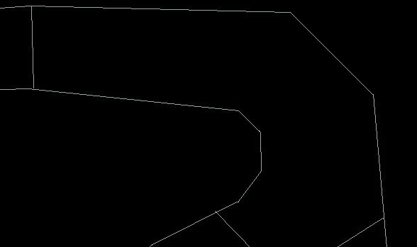

[](https://opensource.org/licenses/MIT)


Solving a racing simulation using multi-objective evolutionary optimization.



## Installation

```
git clone https://github.com/NotEnoughSnow/kart-simulator.git
cd kart-simulator
pip install -r requirements.txt
```

## Running 

To run in manual play mode <br>
`python main.py`

You can specify a run mode <br>
`python main.py --mode <mode>`

Modes:

- play

Manually test the simulation

- optimize

Optimize the weights of the NN using a multi-objective evolutionary algorithm. Usually the first step in the training proccess
(Not available yet)

- train

Train a NN model with PPO either given the optimized starting weights or from scratch.
(Currently only supports from scratch training)

- test

Test and evaluate the performance of the NN.
(Not available yet)


## About the project

This project is part of a Masters in Artificial Intelligence course project during the fall semester of 2023 at ELTE university, Budapest.

The Project Aims to achieve the following:
- Create a modular racing simulation in order to facilitate current and future experimentation
- Solve the simulation using common reinforcement learning (RL) methods
- Optimize the simulation using evolutionary algorithms in order to satisfy multiple objectives
- Compare data and results

### Project structure

- core : Contains modules for PPO training and evaluation
- evolutionary : Contains modules for the optimization
- sim : A pygame gym-like simulation
- experimental : Modules, environments, componenets, and methods used to experiment with different ways to solve the simulation (not yet included)

### About the simulation

Built in Pygame and Pymunk as a gym-like gokart racing simulator. The simulation and project were made with extendibility in mind.
The simlation includes:
- a pymunk physics implementation to set up the player and track dynamics
- UI
- ray-casting 2d vision
- gym env structure; step, reset, render methods
- extendable methods for observations, actions, ect.. 

## Future development

- Fully implement and test the optimization methods
- Collect and compare data from different methodologies
- Migrate Simulation to Box2D instead of Pymunk
- Experiment with different components and their effects on training
- Expand the project to account for other components and simulations as well as different ways to make a more generalized solution
- Implement and experiment with spiking neural networks
- Implement in a robotics environment