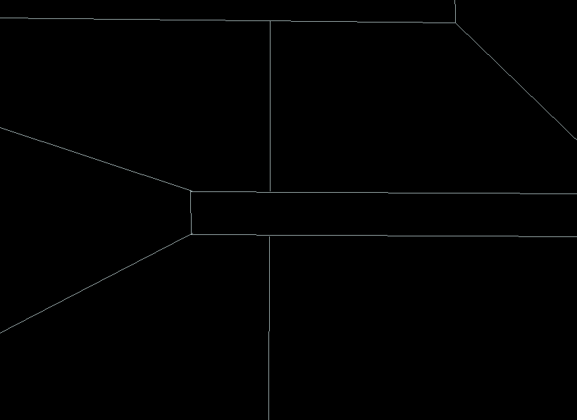
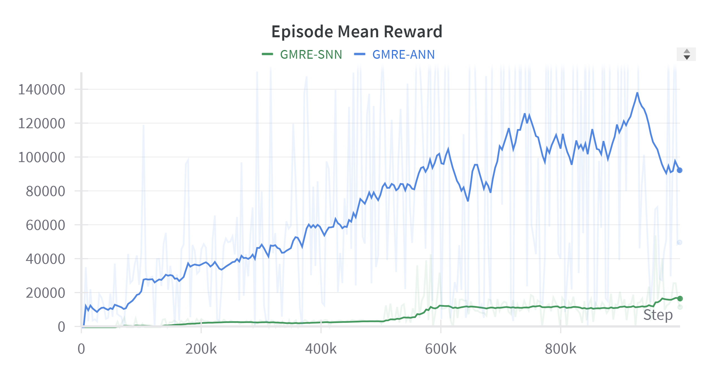
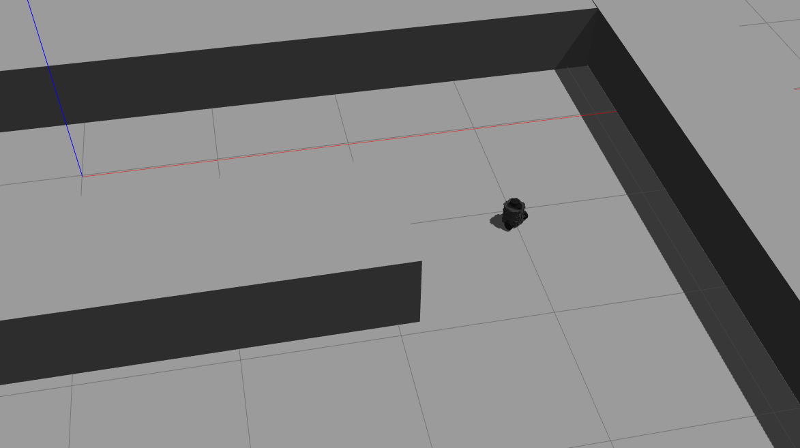

[](https://opensource.org/licenses/MIT)


# Racing simulation control using proximal policy optimization (PPO) and spiking neural networks (SNNs).




## Quickstart

#### Installation

Clone and install the project requirements with the following:
```
git clone https://github.com/NotEnoughSnow/kart-simulator.git
cd kart-simulator
pip install -r requirements.txt
```

#### Running

**main.py** connects various modules which can be ran by specifying the desired mode.

#### Maunally testing the simulation:
A good way to test if the base software works is by changing the args.mode to "play" in main.py at the very bottom which is done with the following :
```
args.mode = "play"
```
Then in **main()** set the environment type and map with:
```
env_name = steer_gazebo

track_type = "loader"
track_name = "big_S"
```

This allows you to use the keyboard keys : **W, A, S, D** to control the agent in the **steer-mouvement** environment in the **large map**.

#### To train a model:
- Change args.mode to "train"
- Choose an environment type (grid_env, steer_env)
- Set the saving directory with **save_config**
- Set the training settings in "KartSimulator/runners/train". Including saving options, seed, number of timesteps, network type, and hyperparameters.
- launch

#### To visualize a training session:
- Change args.mode to "replay"
- Keep the environment type (grid_env, steer_env) the same as the run.
- Make sure **project_name" in main.py is set to the training session's project name.
- Set the replay file in "KartSimulator/runners/replay" under **run_name** (e.g.,run_name = "sample-ANN-2")
- Select the replay mode (batch, all) to view the training by batches or to visualize all of the training at once.
- launch


*List of avaiable simulation types, modes, and tracks are available below.*


## About the project

This project was submitted as part of a thesis research project during my Masters degree in Artificial Intelligence at ELTE university, Budapest.
The earliest version of the simulation started as a course project during the fall semester of 2023.

The primary objective of this research is to investigate the viability of Spiking Neural Networks (SNNs) within the context of Reinforcement Learning (RL). Specifically, it seeks to evaluate whether SNNs can perform effectively in RL settings and to explore their potential advantages over traditional Artificial Neural Networks (ANNs).
Conducting this study in a simulated environment provides the necessary control for experimentation and analysis while also addressing challenges associated with real-world applications.

The project aims to:
- Compare SNNs to ANNs in the context of RL and robotics in order to explore their advantages and limitations.
- Explore various SOTA methodologies in relation to SNNs and computational neuroscience within the outlined context.
- Explore the sim2real gap by deploying trained models into robotics.
- Explore the effeciency and challenges of neuromorphic hardware.


### Project structure

- core : Contains modules for PPO training and evaluation
- runners : Different modules used in main.py (e.g., training, evaluating)
- sim : A directory collecting the different simulations and their tools

### About the simulation

TODO about the sim.
The simlation includes:
- a pymunk physics implementation to set up the player and track dynamics
- UI
- ray-casting 2d vision
- gym env structure; step, reset, render methods
- extendable methods for observations, actions, ect.. 

### Results





These graphs show the training results on the grid (directional) and steering mouvement environments. While ANNs manage to converge quickly and effectively,SNNs still struggle. 



This screenshot shows the settings used in order to evaluate the trained policy on Gazebo. The robot struggled to move as freely as it's simulation counterpart due to input mismatch, but it was slowly following the policy.


## Configurations

Available modes:

- play : Manually test the simulation
- train : Train a NN model with PPO either given the optimized starting weights or from scratch
- eval : Test and evaluate the performance of the NN

Available maps:

- big_S
- small_S

Available environment types:

- grid_env : an environment with 4-directional mouvemenet. The agent can accelerate freely in all directions.
- steer_env : an environment with car-like accelerating and steering mouvements. This version is more challenging to train but offers more complexity and authenticity to the driving/racing control problem.

## Future development

- Collect and compare data from different methodologies
- Migrate Simulation to Box2D instead of Pymunk
- Experiment with different components and their effects on training
- Implement and experiment with various computational neuroscience methodologies
