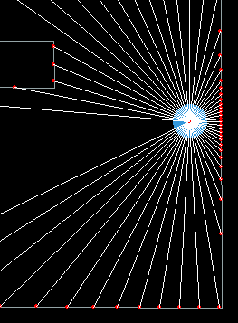
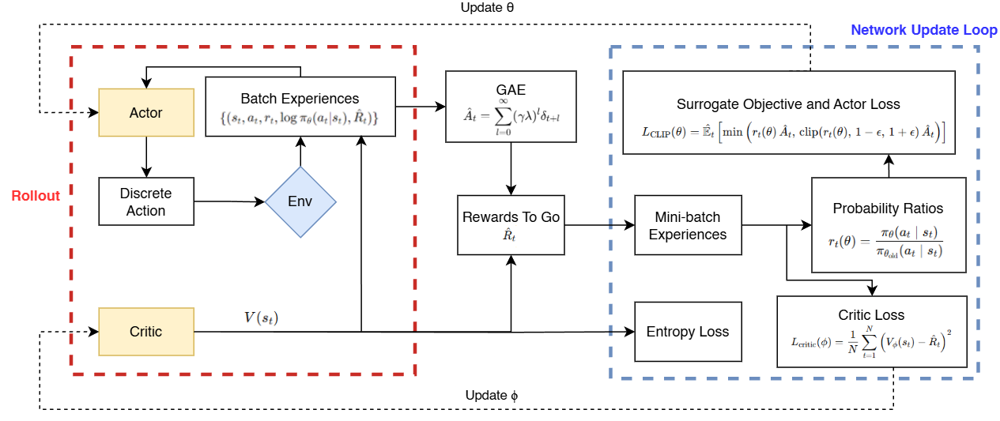
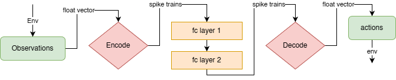
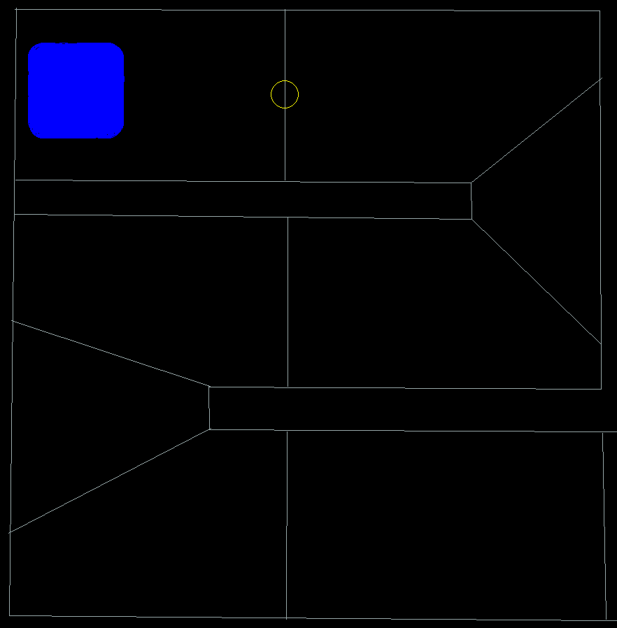
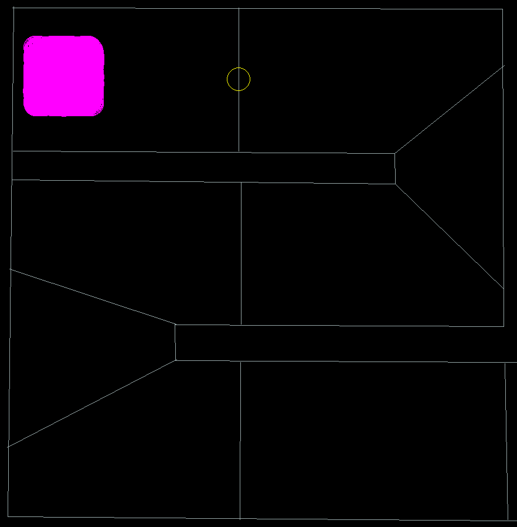
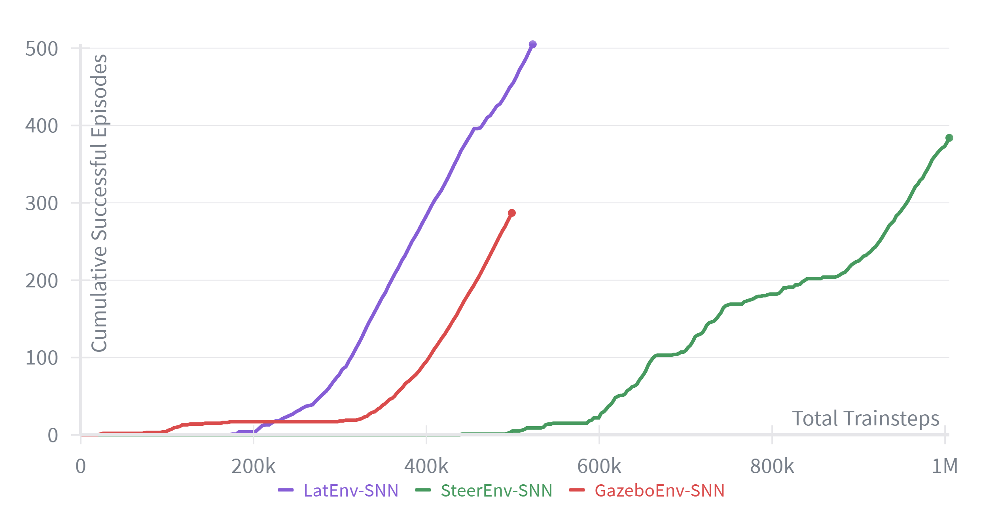

[](https://opensource.org/licenses/MIT)


# Racing simulation control using proximal policy optimization (PPO) and spiking neural networks (SNNs).


# Quickstart

### Installation

Clone and install the project requirements with the following:
```
git clone https://github.com/NotEnoughSnow/kart-simulator.git
cd kart-simulator
pip install -r requirements.txt
```

### Running

**main.py** connects various modules which can be ran by specifying the desired mode.

### Maunally Testing the Simulation:
A good way to test if the base software works is by changing the args.mode to "play" in main.py at the very bottom which is done with the following :
```
args.mode = "play"
```
Then in **main()** set the environment type and map with:
```
env_name = steer_gazebo

track_type = "loader"
track_name = "big_S"
```

This allows you to use the keyboard keys : **W, A, S, D** to control the agent in the **steer-mouvement** environment in the **large map**.

### To train a Model:
- Change args.mode to "train"
- Choose an environment type (grid_env, steer_env)
- Set the saving directory with **save_config**
- Set the training settings in "KartSimulator/runners/train". Including saving options, seed, number of timesteps, network type, and hyperparameters.
- launch

### To visualize a Training Session:
- Change args.mode to "replay"
- Keep the environment type (grid_env, steer_env) the same as the run.
- Make sure ""project_name" in main.py is set to the training session's project name.
- Set the replay file in "KartSimulator/runners/replay" under **run_name** (e.g.,run_name = "sample-ANN-2")
- Select the replay mode (batch, all) to view the training by batches or to visualize all of the training at once.
- launch


*List of avaiable simulation types, modes, and tracks are available below.*


# About the Project

This project was submitted as part of a thesis research project during my Masters degree in Artificial Intelligence at ELTE university, Budapest.
The earliest version of the simulation started as a course project during the fall semester of 2023.

The primary objective of this research is to investigate the viability of Spiking Neural Networks (SNNs) within the context of Reinforcement Learning (RL). Specifically, it seeks to evaluate whether SNNs can perform effectively in RL settings and to explore their potential advantages over traditional Artificial Neural Networks (ANNs).
Conducting this study in a simulated environment provides the necessary control for experimentation and analysis while also addressing challenges associated with real-world applications.

The project aims to:
- Compare SNNs to ANNs in the context of RL and robotics in order to explore their advantages and limitations.
- Explore various SOTA methodologies in relation to SNNs and computational neuroscience within the outlined context.
- Explore the sim2real gap by deploying trained models into robotics.
- Explore the effeciency and challenges of neuromorphic hardware.


## Project Structure

- core : Contains modules for PPO training and evaluation
- runners : Different modules used in main.py (e.g., training, evaluating)
- sim : A directory collecting the different simulations and their tools

## Simulations and Environments

<<<<<<< HEAD
### Gymnasium Environments
=======
The simlation includes:
- a pymunk physics implementation to set up the player and track dynamics
- UI
- ray-casting 2d vision
- gym env structure; step, reset, render methods
- extendable methods for observations, actions, ect.. 
>>>>>>> 0bb30e9efbf55fb9f4265b291940d406177d3845

The project houses 3 different top-down pygame/gymnasium racing environments with varying difficulties (ascending):
- **Grid-Env** : an environment with 4-directional mouvement. The agent can accelerate freely in all directions.
- **Gazebo-Env** : an environment with sequential-like mouvement. The agent can either control its linear acceleration or its rotational acceleration, but not at the same time. This environment was specifically made to match the ROS/GAZEBO setup, and targets a 2-wheel with differential drive robotic architecture.
- **Steer-Env** : an environment with car-like accelerating and steering mouvement. This version is more challenging to train but offers more complexity and authenticity to the driving/racing control problem.

### Environment Features

- Ray-casting 2d vision
- A pymunk physics implementation to set up the player and track dynamics
- UI for tracking important information
- Gym env structure; step, reset, render methods
- Flexible methods for observations, actions, ect.. 

**Observations:**



The agents mainly use LIDAR scans to navigate the environment. They also receive kinematic information.

Example observation : [LIDAR scans, position, angle, velocity].

**Reward Function (adjustable):**
- Passive penalty 
- Out of bounds penalty
- Stand still or desert penalty
- Finish track reward
- Action-distance reward/penalty
- Steer reward/penalty (depends on env type)

## Proximal Policy Optimization:



## Spiking Network:




The spiking network builds on the ANN by incorporating spiking neurons and various methods to process inputs and outputs from/to spike trains (the data format used by the spiking network, instead of float vectors/tensors).
A spike train is an array of binary events encoding over time: each timestep in the spike train equals to 1 if the neuron spiked, and 0 otherwise.

The input float vector from the environment is processed into spike trains by a rate encoding function:
```math
P(R_{ij}=1)=X_{ij}=1-P(R_{ij}=0)
```
The network contains two full connected layers of leaky-LIF spiking neurons with the following internal mechanism:
- Decay: the neuron (specifically, its membrane) loses charge overtime exponentially.
- Integrate: the neuron accumulates charge over time when exposed to input stimulus (current).
- Fire: once past a certain threshold, the neuron fires, with the possibility of resetting and/or inhabiting further input for a short time window.
The spiking neurons then incorporate the following discretized equation:
```math
U[t+1] = \underbrace{\beta U[t]}_\text{decay} + \underbrace{WX[t+1]}_\text{input} - \underbrace{S[t]U_{\rm thr}}_\text{reset}
```
Where $\beta$ is a the membrane potential decay rate.

Since spikes are non-differentiable, and in order to use backprop, fast-sigmoid surrogate gradients were employed:
```math
\begin{split}S&≈\frac{U}{1 + k|U|} \\
\frac{∂S}{∂U}&=\frac{1}{(1+k|U|)^2}\end{split}
```
Where k represents the steepness of the function and defaults to 25.

Finally, the spikes are decoded using a linear readout layer by averaging the output spike trains and passing them through a linear learnable layer:
```math
Avg\_Spikes_{i} = \frac{1}{N}\sum^{N}_{t=1}Spike\_Train_{i,t}
```
```math
Output = W_{readout}\times Avg\_Spikes+b_{readout}
```

# Results:

SteerEnv ANN vs SNN visual comparison:



Performance of SNN policies compared to ANNs across all environments:

| Environment-Model              | First Finish | 300 Finishes | % of ANN   |
| ------------------------------ | ------------ | ------------ | ---------- |
| LatEnv-ANN<br>LatEnv-SNN       | 141k<br>175k | 402k<br>406k | -<br>99.0% |
| GazeboEnv-ANN<br>GazeboEnv-SNN | 82k<br>22k   | 431k<br>507k | -<br>85.0% |
| SteerEnv-ANN<br>SteerEnv-SNN   | 156k<br>441k | 724k<br>957k | -<br>75.7% |

Cumulative Successful Episodes of SNN policies across all environments:



Where:
- X-axis: How many train-steps a policy was trained on (e.g., 300k).
- Y-axis: How many times in total the policy managed to reach the final goal.
- Each color is the best trained Spiking policy for each environment.
- The graph describes how many times the policy finishes the track throughout a policy training session.


# Configurations

Available modes:

- play: Manually test the simulation.
- train: Train a NN model with PPO either given the optimized starting weights or from scratch.
- eval: Test and evaluate the performance of the NN.
- replay: Visualize a training session.

Available maps:

- big_S
- small_S

Available environment types:

- grid_env
- gazebo_env
- steer_env

# Future development

- Collect and compare data from different methodologies
- Migrate Simulation to Box2D instead of Pymunk
<<<<<<< HEAD
- Improve the pipeline, while using better fitting tools and environments such as IsaacGym, which has GPU support. This will cut the SNNs train time, which is significant.
- Improve the study by testing on real life robots.
- Include neuromorphic hardware for evaluation. Also allows us to measure energy consumption metrics.
=======
- Experiment with different components and their effects on training
- Implement and experiment with various computational neuroscience methodologies
>>>>>>> 0bb30e9efbf55fb9f4265b291940d406177d3845
